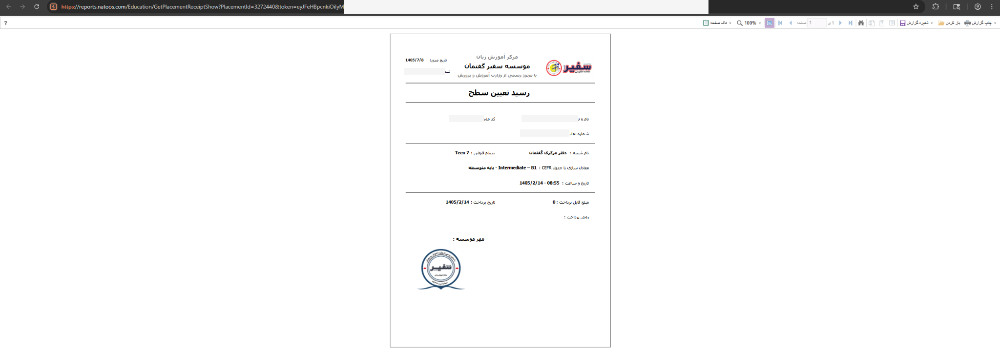
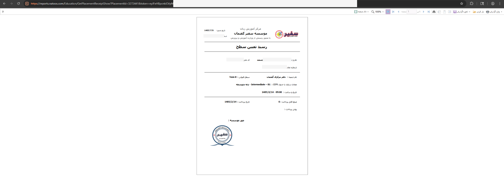
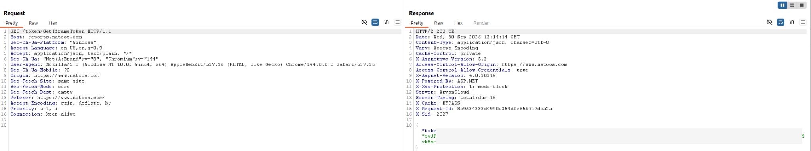
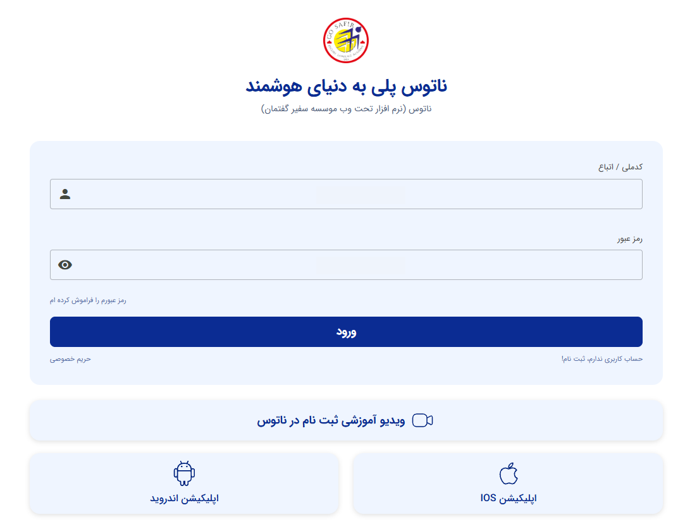
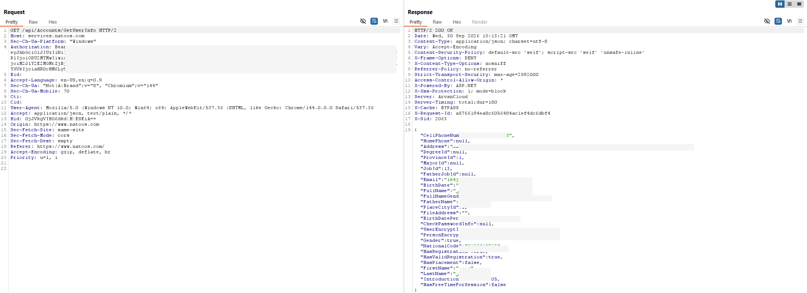
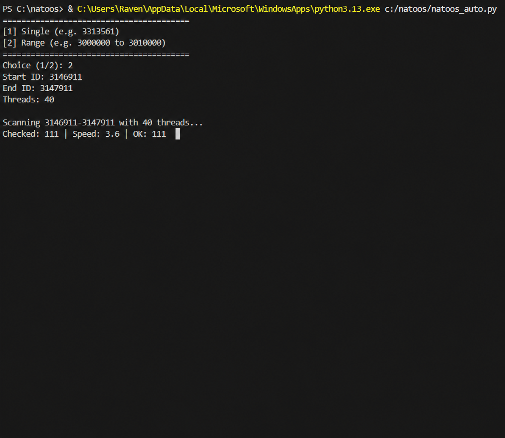
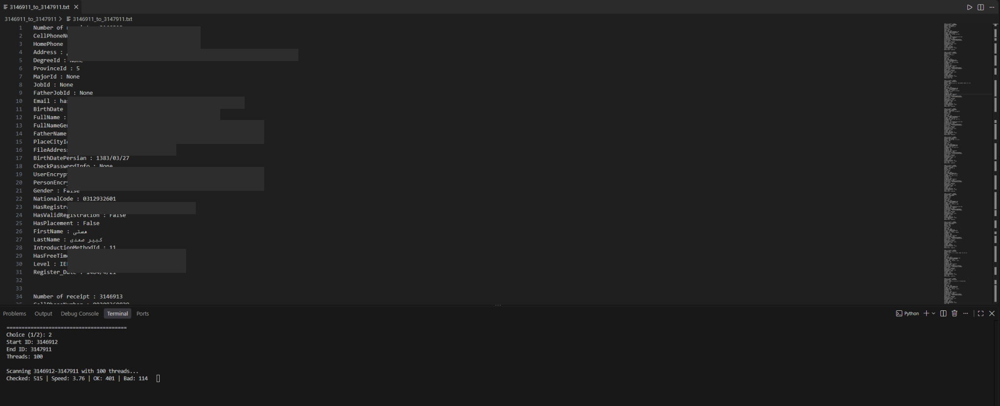
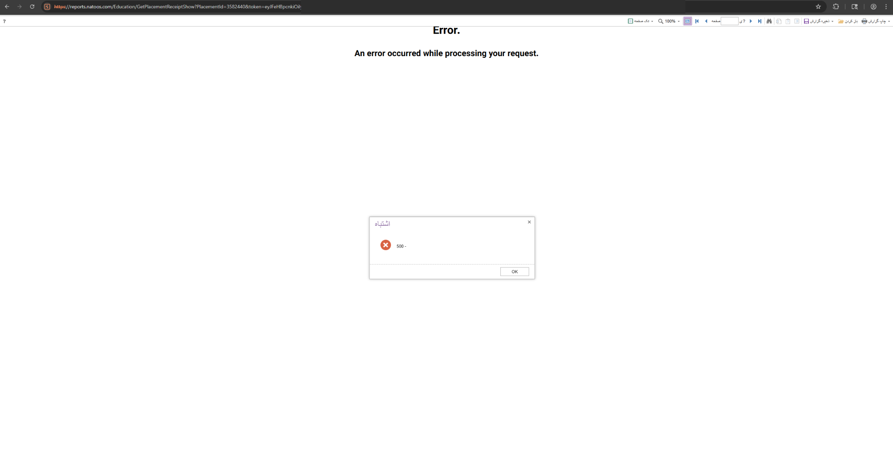

# Natoos Security Research

An authorized security research write-up covering an access-control issue I found in the Natoos platform.

The issue was reported to the organization, fixed, and approved for public disclosure before I published this repository.

| | |
|---|---|
| **Status** | Fixed |
| **Testing** | Authorized |
| **Disclosure** | Approved |
| **Discovered** | September 25, 2026 |
| **Fixed** | September 27, 2026 |

## Overview

While testing the Natoos platform, I found an IDOR in the placement receipt system.

Placement receipts were accessed using a URL containing a `PlacementId`. I noticed that changing this ID could return a receipt belonging to another user.

This became more serious because the receipt contained the user's national code.

At the time of testing, the national code was also being used as both the username and password for the Natoos account.

This meant the issue could be chained:

```text
Placement receipt
      ↓
Change PlacementId
      ↓
Another user's receipt
      ↓
National code exposed
      ↓
National code used for login
      ↓
Authentication token
      ↓
GetUserInfo
      ↓
Additional account information
```

## Initial discovery

I originally reached the platform while trying to access an online language exam.

While looking through the site, I checked the placement receipt functionality and noticed that the receipt ID was directly included in the URL.

A request looked similar to:

```text
/Education/GetPlacementReceiptShow?PlacementId=<ID>&token=<TOKEN>
```

I changed the `PlacementId` and found that the server returned a different user's receipt instead of checking whether that receipt belonged to the current user.

### Receipt examples





The sensitive information in these screenshots has been redacted.

## Report token

The receipt system required a report token.

A new token could be requested from the report service and then used when requesting a receipt.



The token shown in the original request has been removed from the public screenshot.

The problem was that having a valid report token did not prevent a user from changing the `PlacementId` and requesting a receipt that did not belong to them.

## Extracting the national code

I did not need all of the information inside the receipt for the next part of the test.

The important value was the national code.

The receipt response returned HTML, and the national code could be extracted from that response.

At this point the chain became more serious because of how account authentication worked.

## Authentication issue

The Natoos login used the national code as both the username and password.



The same behavior was also available through the account API.

The authentication request used:

```text
POST /api/Accounts/CreateToken
```

with a request body in this format:

```json
{
  "NationalCode": "<NATIONAL_CODE>",
  "Password": "<NATIONAL_CODE>"
}
```

If the credentials were accepted, the server returned an authentication token.

That token could then be used with:

```text
GET /api/Accounts/GetUserInfo
```

to retrieve additional account information.



All personal information and authentication tokens in the screenshot have been redacted.

## Automation

After confirming the issue manually, I wrote a Python tool to automate the testing process.

The tool handled the steps I had already tested manually:

- Request a fresh report token
- Check placement receipt IDs
- Parse the receipt response
- Extract the national code
- Test the account authentication flow
- Request profile information
- Save results for review
- Run checks concurrently using threads

This is what the tool looked like while running:



And this is an example of how the results were stored during testing:



The public repository does **not** contain the original bulk automation tool, raw results, or real user data.

## Impact

The main problem was not just one endpoint.

Several weaknesses could be chained together:

1. A receipt ID could be changed without proper ownership validation.
2. The receipt exposed a national code.
3. The national code was also being used as the account password.
4. Successful authentication returned a bearer token.
5. The bearer token allowed access to additional profile information.

Depending on the account, exposed information could include things such as:

- Full name
- National code
- Phone number
- Email
- Address
- Date of birth
- Registration information
- Placement information
- Other account profile fields

## The fix

The issue was reported to the organization and was fixed shortly afterward.

The receipt system now checks the requested receipt against the authenticated user's session.

If the receipt does not belong to the current user, the server no longer returns the receipt.

This is the behavior after the fix:



The request in the screenshot was rejected instead of returning another user's information.

## What was vulnerable

The issue involved a combination of:

- **IDOR / Broken Access Control**
- **Missing object-level authorization**
- **Weak account credentials**
- **Sensitive information exposure**
- **Vulnerability chaining**

The IDOR was the starting point, but the authentication design significantly increased its impact.

## Remediation

The most important changes were:

- Validate that a requested receipt belongs to the authenticated user
- Perform authorization checks on the server side
- Do not treat possession of a report token as permission to access any receipt
- Do not use national codes as default passwords
- Require separate user-created passwords
- Limit the amount of personal information returned by APIs
- Add rate limiting to sensitive endpoints
- Monitor unusual sequential access to object IDs

More information is available in [`docs/remediation.md`](docs/remediation.md).

## Disclosure timeline

| Date | Event |
|---|---|
| **2026-09-25** | Vulnerability discovered |
| **2026-09-26** | Findings reported to the organization |
| **2026-09-26** | Organization acknowledged the report |
| **2026-09-27** | Vulnerability remediated |
| **2026-09-27** | Permission received for public disclosure |
| **2026-09-30** | Public write-up released |

A separate copy of the timeline is available in [`docs/disclosure-timeline.md`](docs/disclosure-timeline.md).

## Privacy

The original testing involved real account information, so I removed that data from the public version of the project.

The repository does not intentionally contain real:

- National codes
- Names
- Phone numbers
- Email addresses
- Home addresses
- Authentication tokens
- Private account identifiers
- Raw collected records

Screenshots have been redacted before publication.

## Authorization

The testing documented in this repository was performed with permission from the system owner.

I also received permission to publicly document the project after the vulnerability was remediated.

## What I learned

This project was a good example of why small access-control problems should not always be looked at individually.

Changing one numeric ID initially looked like a straightforward IDOR, but combining it with the information exposed by the receipt and the account authentication design made the impact much larger.

It also gave me experience with manually analyzing requests, reproducing the issue through APIs, writing automation for authorized testing, documenting the findings, reporting them, and verifying the fix.

## Disclaimer

This repository documents authorized security research on an issue that has already been fixed.

It is published for educational and defensive security purposes.

Do not test systems you do not own or do not have explicit permission to test.